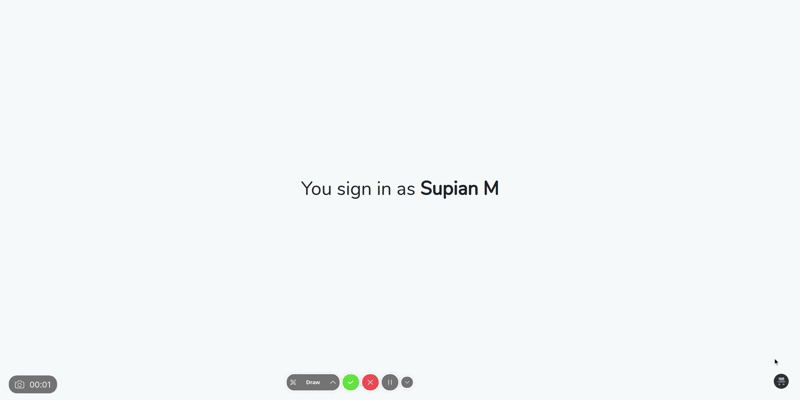

<p align="center">
    
</p>

<p align="center">
    
    
    
    
</p>

# Laravel Impersonate

Is an Impersonation package for the Laravel Framework. With this package you can easily impersonate other users either manually or using the interface we provide.

You don't have to worry about authorizing who can impersonate or who can be impersonated, coz we provided it by default, just need to adjust it a little according to your
rules.

## 1. Installation

> **Warning**
>
> This version is a breaking change, many changes were made to the addition of new features, new UI design, and code structure.
>
> If you are upgrade from an old version, please delete the old assets and republish the assets, configure and reset the [limitations](#311-defining-limitation) on the User Model
> according to this version.

To install the package, simply follow the steps below.

### 1.1. Install The Package

```bash
composer require octopyid/laravel-impersonate:^3
```

### 1.2. Publish The Package

```bash
artisan vendor:publish --provider="Octopy\Impersonate\ImpersonateServiceProvider"
```

> **Note**
>
> Sometimes some users experience the problem of layout after upgrading the package, this can be solved by deleting the `public/vendor/octopyid/impersonate` folder then republish
> the assets.

### 1.3. Add Impersonate Trait to  User Model

Add the trait `Octopy\Impersonate\Concerns\Impersonate` to your **User** model.

```php
namespace App\Models;

use Octopy\Impersonate\Concerns\Impersonate;
use Illuminate\Foundation\Auth\User as Authenticatable;

class User extends Authenticatable
{
    use Impersonate;
}
```

## 2. Configuration

This configuration is intended to customize the appearance of Laravel Impersonate, if you don't need a UI, don't forget to set `IMPERSONATE_ENABLED` to `false` in your environment
file because it is enabled by default.

Please refer to the [impersonate.php](config/impersonate.php) file to see the available configurations.

## 3. Usage

### 3.1. Basic Usage

By default, you don't need to do anything, but keep in mind, Impersonation can be done by anyone if you don't define the rules of who can do impersonation or who can be
impersonated.

#### 3.1.1. Defining Limitation

To limit who can do **impersonation** or who is can be **impersonated**, add
`impersonatable(ImpersonateAuthorization $authorization)` on the Model to enforce the limitation.

The **impersonator** method is intended for who can perform the impersonation and the **impersonated** method is intended for anyone who is allowed to be imitated.

> **Warning**
>
> Not defining the ImpersonateAuthorization rules in the Model or misdefining them can lead to serious security issues.

The example below uses [Laratrust](https://github.com/santigarcor/laratrust/) for role management where **SUPER_ADMIN** can perform impersonation against **CUSTOMER**. Feel
free to use any other Role Management you like.

```php
use Octopy\Impersonate\Concerns\Impersonate;
use Illuminate\Foundation\Auth\User as Authenticatable;

class User extends Authenticatable
{
    use Impersonate;
    
    /**
     * @param  ImpersonateAuthorization $authorization
     * @return void
     */
    public function impersonatable(ImpersonateAuthorization $authorization) : void
    {
        $authorization->impersonator(function (User $user) {
            return $user->hasRole('SUPER_ADMIN');
        });

        $authorization->impersonated(function (User $user) {
            return $user->hasRole('CUSTOMER');
        });
    }
}
```

### 3.2. Advanced Usage

#### 3.2.1. Impersonating User Manually

Sometimes you need Impersonating manually, to perform it, you can use the impersonate singleton.

```php
App::make('impersonate')->take($admin, $customer);
```

Or you just simply call the impersonation method directly through the User Model.

```php
$admin->impersonate($customer);
```

#### 3.2.2. Defining Guard

Sometimes, you want to use custom guards for authentication, instead of the built-in guards.

There are two ways to define Guard.

##### 3.2.2.1. On The Fly

```php
$impersonate->guard('foo')->impersonate($admin, $customer);
```

##### 3.2.2.2 Globally

You can use Guard for all ImpersonateAuthorization actions by registering the guard with the `AppServiceProvider`.

```php
public function boot() : void 
{
    App::make('impersonate')->guard('foo');
}
```

#### 3.2.3. Leaving ImpersonateAuthorization Mode

To leave ImpersonateAuthorization mode, you just need to call the `leave` method on impersonate singleton. This will return you to the original user.

```php
$impersonate->leave();
```

Or via Model directly, but you can't use guard on the fly.

```php
$admin->impersonate->leave();
```

Don't hesitate to use a guard if you need it.

## Disclaimer

This package can pose a serious security issue if used incorrectly, as anybody will be able to take control of any user's account.

By using this package, you agree that Octopy ID and the contributors of this package cannot be held responsible for any damages caused by using this package.

## Security

If you discover any security related issues, please email [supianidz@gmail.com](mailto:supianidz@gmail.com) instead of using the issue
tracker.

## Credits

- [Supian M](https://github.com/SupianIDz)
- [Octopy ID](https://github.com/OctopyID)

## License

The MIT License (MIT). Please see [License File](LICENSE) for more information.
